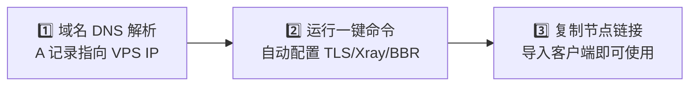

# Agent Service Plus 🚀

<p align="center">
  <strong>只要一个域名 + 一台 VPS，一键部署高性能、全自动证书的 AI 加速节点</strong>
</p>

<p align="center">
  <a href="https://console.svc.plus/products/xconnect"></a>
  <a href="https://github.com/ai-workspace-xstream/xconnect-app/releases/tag/main-149"></a>
  
  
</p>

---

## 🌟 核心亮点

- ⚡ **零门槛 3 分钟一键自建**：单行 Shell 命令全自动安装，无需手动编辑繁琐 JSON。
- 🔒 **全自动 HTTPS / TLS 证书**：集成 Caddy 自动化 Let's Encrypt 证书签发与平滑续期。
- 🏎️ **内核级低延迟优化**：安装时自动应用 Linux BBR 拥塞控制 + FQ 队列调度优化。
- 📦 **双架构支持**：完美适配主流 Linux 发行版（Ubuntu / Debian / CentOS / Alpine），支持 AMD64 (x86_64) 与 ARM64 (aarch64)。
- 🔄 **多种工作模式**：既支持 100% 离线独立自建，也支持与 [XConnect 控制台](https://console.svc.plus/products/xconnect) 或私有部署后端实现多租户集群管理。

---

## 🧭 普通用户向导：3 步极速上手



### 第 1 步：准备域名解析
准备一个你拥有的域名（例如 `xhttp.example.com`），在你的域名 DNS 提供商处添加一条 **A 记录**，将该域名解析到你的 **VPS 服务器公网 IP**。

> 💡 *确保解析已生效（可以通过 `ping xhttp.example.com` 确认返回的是你 VPS 的 IP 地址）。*

---

### 第 2 步：执行一键部署脚本

通过 SSH 连接进入你的 VPS，粘贴并执行以下命令（将 `xhttp.example.com` 替换为你的真实域名）：

```bash
curl -fsSL https://raw.githubusercontent.com/cloud-neutral-toolkit/agent.svc.plus/main/scripts/setup-proxy.sh | \
  bash -s -- --node xhttp.example.com
```

> **提示（纯独立运行）**：如果你希望完全本地独立运行（不连接任何云端管理端），可直接加上 `--standalone` 参数：
> ```bash
> curl -fsSL https://raw.githubusercontent.com/cloud-neutral-toolkit/agent.svc.plus/main/scripts/setup-proxy.sh | \
>   bash -s -- --node xhttp.example.com --standalone
> ```

---

### 第 3 步：获取节点链接，连接客户端

脚本运行完成后，终端会自动打印出 **VLESS 节点导入链接**（包括 XHTTP 模式与 TCP Vision 模式）和对应的 UUID。

#### 客户端连接方式推荐：

1. 🌟 **自研客户端（推荐体验）**：
   - 下载 **[XConnect App 客户端 (85% 完成度预览版)](https://github.com/ai-workspace-xstream/xconnect-app/releases/tag/main-149)**
   - 支持 macOS（Apple Silicon）、Windows、iOS 与 Linux。界面极简，内置系统级网络代理与诊断工具。
2. 📱 **通用第三方客户端**：
   - 复制终端输出的 `vless://...` 链接，在 **OneXray**、**v2rayN** (Windows)、**v2rayNG** (Android)、**Sing-box** 或 **Surge** 中选择「从剪贴板导入」即可直接使用！

---

## 🛠️ 部署模式对比与使用场景

| 场景 | 部署命令 / 说明 | 适用对象 |
| :--- | :--- | :--- |
| **1. 极简一键自建** | `curl ... \| bash -s -- --node <your-domain> --standalone` | 个人开发者、小白用户，单机独立加速 |
| **2. 托管云端同步** | `AUTH_URL=<url> INTERNAL_SERVICE_TOKEN=<token> curl ... \| bash -s -- --node <your-domain>` | 与 [console.svc.plus](https://console.svc.plus/products/xconnect) 联动，自动同步多租户配置 |
| **3. 全栈开源私有化** | 配合 [portal](https://github.com/ai-workspace-xstream/portal) 与 [postgresql.svc.plus](https://github.com/ai-workspace-xstream/postgresql.svc.plus) 自建完整平台 | 企业 IT、团队协作与极客全栈 |

---

## ⚙️ 常用进阶参数与配置

一键安装脚本 `scripts/setup-proxy.sh` 提供了丰富的可选参数：

```bash
# 1. 仅升级 Agent 与核心二进制（保留现有配置文件与证书不变）
curl -fsSL https://raw.githubusercontent.com/cloud-neutral-toolkit/agent.svc.plus/main/scripts/setup-proxy.sh | \
  bash -s -- --upgrade-only

# 2. 与 postgresql.svc.plus 数据库同机部署（自动放行 5443/tcp 端口）
OPEN_STUNNEL_5443=true \
curl -fsSL https://raw.githubusercontent.com/cloud-neutral-toolkit/agent.svc.plus/main/scripts/setup-proxy.sh | \
  bash -s -- --node xhttp.example.com --open-stunnel-5443

# 3. 搭配 Cloudflare API Token 自动配置 DNS 解析
CLOUDFLARE_API_TOKEN="your-cf-token" \
curl -fsSL https://raw.githubusercontent.com/cloud-neutral-toolkit/agent.svc.plus/main/scripts/setup-proxy.sh | \
  bash -s -- --node xhttp.example.com
```

---

## ☁️ 边缘与容器化部署（Cloudflare / Cloud Run）

对于需要无服务器（Serverless）或边缘计算的用户，本项目在 `deploy/` 下提供了开箱即用的支持：

### 1. Cloudflare Workers 边缘代理
位于 `deploy/cloudflare/workers`，支持快速部署边缘 API 转发：
```bash
make cf-worker-install
make cf-worker-deploy
```

### 2. Cloudflare Containers / Google Cloud Run
支持在单一容器内同时运行 Xray 与 Agent 守护进程：
```bash
make cf-containers-install
make cf-containers-deploy
```
详细指南请参考 [deploy/cloudflare/containers/README.md](deploy/cloudflare/containers/README.md)。

---

## ❓ 常见问题排查（FAQ）

<details>
<summary><strong>Q1: 脚本执行后提示证书申请失败？</strong></summary>

1. 请确认你的域名 A 记录已准确解析到当前 VPS 公网 IP。
2. 确认服务器防火墙已开放 `80` 和 `443` 端口（Caddy 通过 HTTP-01/TLS-ALPN-01 验证域名所有权）。
3. 如果 VPS 处于云厂商安全组内（如阿里云、腾讯云、AWS），请在云控制台安全组规则中放行入方向 `80` 与 `443` 端口。
</details>

<details>
<summary><strong>Q2: 如何查看服务运行状态与日志？</strong></summary>

```bash
# 查看 Caddy 状态与证书日志
systemctl status caddy
journalctl -u caddy -n 50 --no-pager

# 查看 Xray 服务状态
systemctl status xray
journalctl -u xray -n 50 --no-pager

# 查看 Agent 控制服务（如已启用）
systemctl status agent-svc-plus
journalctl -u agent-svc-plus -n 50 --no-pager
```
</details>

<details>
<summary><strong>Q3: 为什么推荐使用 XHTTP 协议？</strong></summary>

XHTTP 基于 HTTP/3 与 HTTP/2 传输封装，在面对复杂的跨国网络抖动与封锁环境时，具有更高的抗丢包能力与更佳的多路复用性能，特别适合 AI 交互（如 Cursor 流式代码补全、Claude/ChatGPT 长上下文流式对话）等低延迟敏感型场景。
</details>

---

## 🔗 相关项目与资源

- 🌐 **[XConnect 控制台 (云端免运维)](https://console.svc.plus/products/xconnect)**
- 📱 **[XConnect 客户端下载 (85% 完成度版本)](https://github.com/ai-workspace-xstream/xconnect-app/releases/tag/main-149)**
- 🏢 **[AI Workspace XStream 完整开源组织](https://github.com/ai-workspace-xstream)**
- 📖 **[架构与设计规范](docs/design.md)**
