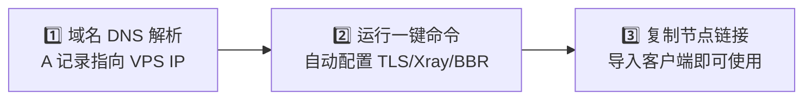

# XConnect Edge Agent 🚀

<p align="center">
  <strong>只要一个域名 + 一台 VPS，一键部署高性能、全自动证书的 AI 加速节点</strong>
</p>

<p align="center">
  <a href="https://console.svc.plus/products/xconnect"></a>
  <a href="https://github.com/ai-workspace-xstream/xconnect-app/releases/tag/main-149"></a>
  
  
</p>

---

## 📡 项目定位

**XConnect Edge Agent** 是部署在 XConnect 代理节点上的边缘控制代理，负责把节点运行时连接到 [accounts 控制面](https://github.com/ai-workspace-services/accounts)：

- 🔐 使用节点凭据与 `accounts` 完成认证通信。
- 🔄 同步用户/节点配置，并在本机生成和更新 Xray 配置。
- 💓 上报节点心跳、健康状态、同步进度及运行信息。
- ⚙️ 管理 Xray 配置加载与服务生命周期；Caddy 负责 HTTPS/TLS 与入口反向代理。

它是节点侧的控制面组件，不是账号数据库、计费真相源或独立的指标存储服务。指标采集由 `xray-exporter` 等组件负责。

> **English**: XConnect Edge Agent is the node-side control-plane agent for XConnect. It authenticates with `accounts`, synchronizes node and client configuration, reports node health and sync status, and manages the local Xray runtime behind Caddy.

---

## 🌟 核心亮点

- ⚡ **零门槛 3 分钟一键自建**：单行 Shell 命令全自动安装，无需手动编辑繁琐 JSON。
- 🔒 **全自动 HTTPS / TLS 证书**：集成 Caddy 自动化 Let's Encrypt 证书签发与平滑续期。
- 🏎️ **内核级低延迟优化**：安装时自动应用 Linux BBR 拥塞控制 + FQ 队列调度优化。
- 📦 **双架构支持**：完美适配主流 Linux 发行版（Ubuntu / Debian / CentOS / Alpine），支持 AMD64 (x86_64) 与 ARM64 (aarch64)。
- 🔄 **灵活的控制面接入**：既支持 100% 离线独立自建，也支持通过 `accounts` 与 [XConnect 控制台](https://console.svc.plus/products/xconnect) 或私有部署后端实现节点集群管理。

---

## 🧭 普通用户向导：3 步极速上手



### 第 1 步：准备域名解析
准备一个你拥有的域名（例如 `xhttp.example.com`），在你的域名 DNS 提供商处添加一条 **A 记录**，将该域名解析到你的 **VPS 服务器公网 IP**。

> 💡 *确保解析已生效（可以通过 `ping xhttp.example.com` 确认返回的是你 VPS 的 IP 地址）。*

---

### 第 2 步：执行一键部署脚本

通过 SSH 连接进入你的 VPS，粘贴并执行以下命令（将 `xhttp.example.com` 替换为你的真实域名）：

已有 `agent-svc-plus` 安装的节点重新执行此命令即可迁移到 `xconnect-edge-agent` 服务名；脚本会先停止旧服务，避免同一节点重复上报。

```bash
curl -fsSL https://raw.githubusercontent.com/ai-workspace-xstream/xconnect-edge-agent/main/scripts/setup-proxy.sh | \
  bash -s -- --node xhttp.example.com
```

> **提示（纯独立运行）**：如果你希望完全本地独立运行（不连接任何云端管理端），可直接加上 `--standalone` 参数：
> ```bash
> curl -fsSL https://raw.githubusercontent.com/ai-workspace-xstream/xconnect-edge-agent/main/scripts/setup-proxy.sh | \
>   bash -s -- --node xhttp.example.com --standalone
> ```

---

### 第 3 步：获取节点链接，连接客户端

脚本运行完成后，终端会自动打印出 **VLESS 节点导入链接**（包括 XHTTP 模式与 TCP Vision 模式）和对应的 UUID。

#### 客户端连接方式推荐：

1. 🌟 **自研客户端（推荐体验）**：
   - 下载 **[XConnect App 客户端 (85% 完成度预览版)](https://github.com/ai-workspace-xstream/xconnect-app/releases/tag/main-149)**
   - 支持 macOS（Apple Silicon）、Windows、iOS 与 Linux。界面极简，内置系统级网络代理与诊断工具。
2. 📱 **通用第三方客户端**：
   - 复制终端输出的 `vless://...` 链接，在 **OneXray**、**v2rayN** (Windows)、**v2rayNG** (Android)、**Sing-box** 或 **Surge** 中选择「从剪贴板导入」即可直接使用！

---

## 🛠️ 部署模式对比与使用场景

| 场景 | 部署命令 / 说明 | 适用对象 |
| :--- | :--- | :--- |
| **1. 极简一键自建** | `curl ... \| bash -s -- --node <your-domain> --standalone` | 个人开发者、小白用户，单机独立加速 |
| **2. 托管云端同步** | `AUTH_URL=<url> INTERNAL_SERVICE_TOKEN=<token> curl ... \| bash -s -- --node <your-domain>` | 与 [console.svc.plus](https://console.svc.plus/products/xconnect) 联动，自动同步多租户配置 |
| **3. 全栈开源私有化** | 配合 [portal](https://github.com/ai-workspace-xstream/portal) 与 [postgresql.svc.plus](https://github.com/ai-workspace-xstream/postgresql.svc.plus) 自建完整平台 | 企业 IT、团队协作与极客全栈 |

---

## 🔗 与 accounts 服务对接部署

### 1. 对接关系

`accounts` 是控制面，`xconnect-edge-agent` 是节点侧运行时。Agent 不直接访问
accounts 数据库，也不负责创建账号；它只通过 HTTPS 调用 accounts 的 Agent API：

| Agent 请求 | 用途 | 成功响应 |
| :--- | :--- | :--- |
| `GET /api/agent-server/v1/users` | 拉取当前允许接入 Xray 的用户及 UUID | `200`，返回 `clients`、`total` |
| `GET /api/agent-server/v1/users/events` | 监听用户配置版本变化，触发即时同步 | SSE 长连接 |
| `POST /api/agent-server/v1/status` | 上报心跳、健康状态、同步版本和 Xray 状态 | `204` |
| `GET /healthz` | 检查 accounts 服务是否可访问 | `200` |

每次 Agent API 请求都会携带以下请求头：

```text
Authorization: Bearer <INTERNAL_SERVICE_TOKEN>
X-Service-Token: <INTERNAL_SERVICE_TOKEN>
X-Agent-ID: <唯一节点 ID>
```

其中 `X-Agent-ID` 通常使用节点域名，例如 `hk-xhttp.example.com`。同一个 token
可以供多个节点使用，但每个节点的 `agent.id` 必须唯一且保持稳定，这样 accounts
才能分别记录节点状态。

### 2. 先部署 accounts 控制面

在 accounts 服务侧准备以下配置：

1. 使用 `server-agent` 运行模式，确保对外暴露 `/api/agent-server/v1/*`。
2. 为服务配置 HTTPS 公网地址，例如 `https://accounts.example.com`；`AUTH_URL`
   只填写域名根地址，不要把 `/api/agent-server/v1` 拼进去。
3. 在 accounts 的运行时密钥管理中设置 `INTERNAL_SERVICE_TOKEN`。该值不能提交到
   Git，也不要写入公开文档。
4. accounts 使用 PostgreSQL 持久化用户、节点和订阅状态；Agent 节点只需要能够
   访问 accounts 的 HTTPS 端口，不需要访问 accounts 数据库。

accounts 仓库提供 VPS、Docker 和 Cloud Run 三种部署路径。以 Docker 或 Cloud Run
为例，先完成 accounts 部署并记下服务 URL；以 VPS 方式部署时，Caddy 通常监听
`80/443` 并反向代理到 accounts 的 `:8080`：

```bash
# accounts 仓库
curl -fsSL "https://raw.githubusercontent.com/ai-workspace-services/accounts/main/scripts/setup.sh?$(date +%s)" \\
  | bash -s -- accounts.example.com --mode docker --deploy
```

如果 accounts 侧显式配置 Agent 凭据，可在其配置中使用与 Agent 相同的 token：

```yaml
agents:
  credentials:
    - id: "edge-node-hk-xhttp"
      name: "Hong Kong XHTTP node"
      token: "<与 INTERNAL_SERVICE_TOKEN 相同的值>"
      groups:
        - "default"
```

注意：accounts 启动时如果 `agents.credentials` 非空，会优先使用这组凭据；此时
`INTERNAL_SERVICE_TOKEN` 只作为其他内部服务的密钥，不会自动替换上面的
`token`。如果希望使用共享 token 兜底，请不要配置 `agents.credentials`，仅在
accounts 运行时注入 `INTERNAL_SERVICE_TOKEN`；生产环境仍建议通过 Vault/Secret
Manager 注入，不要把明文 token 提交到配置文件。

多节点场景建议使用一个专用的 Agent token，并通过每个节点的 `X-Agent-ID` 区分节点；
不要为每台机器复制数据库凭据或授予数据库访问权限。

### 3. 一键部署并接入 Agent 节点（推荐）

确认 accounts 已可访问后，在每台代理节点上执行。下面的 token 只通过当前 Shell
环境传入，不要把真实 token 固定写进脚本或仓库：

```bash
export AUTH_URL="https://accounts.example.com"
export INTERNAL_SERVICE_TOKEN="<accounts 的 Agent token>"

curl -fsSL https://raw.githubusercontent.com/ai-workspace-xstream/xconnect-edge-agent/main/scripts/setup-proxy.sh | \\
  bash -s -- --node hk-xhttp.example.com
```

脚本会完成以下工作：

- 安装或更新 Xray、Caddy 和 `xconnect-edge-agent`；
- 生成 `/etc/agent/account-agent.yaml`，把 `agent.id` 写成 `--node` 的值；
- 将 `AUTH_URL` 写入 `agent.controllerUrl`，将 `INTERNAL_SERVICE_TOKEN` 写入
  `agent.apiToken`；
- 创建并启用 `xconnect-edge-agent.service`，同时配置 XHTTP/TCP 两套 Xray 同步目标。

也可以显式传参：

```bash
curl -fsSL https://raw.githubusercontent.com/ai-workspace-xstream/xconnect-edge-agent/main/scripts/setup-proxy.sh | \\
  bash -s -- --node hk-xhttp.example.com \\
    --auth-url https://accounts.example.com \\
    --internal-service-token "${INTERNAL_SERVICE_TOKEN}"
```

### 4. 已安装节点修改 accounts 地址或 token

重新执行上面的安装命令即可更新 Agent 配置；如果只执行 `--upgrade-only`，配置文件
不会被覆盖，适合只升级二进制的场景。也可以直接编辑配置文件：

```yaml
mode: "agent"

agent:
  id: "hk-xhttp.example.com"
  controllerUrl: "https://accounts.example.com"
  apiToken: "<accounts 的 Agent token>"
  httpTimeout: 15s
  statusInterval: 1m
  syncInterval: 10m
  tls:
    insecureSkipVerify: false
```

修改后重启并检查服务：

```bash
sudo systemctl restart xconnect-edge-agent
sudo systemctl is-active xconnect-edge-agent
sudo journalctl -u xconnect-edge-agent -n 100 --no-pager
```

### 5. 使用 Ansible 部署多台节点

仓库内的 Ansible 方案要求目标机器已经运行过 `scripts/setup-proxy.sh`，先完成
Xray、Caddy 和证书初始化，再由 Ansible 下发 Agent 二进制、配置和 systemd 服务。

```bash
cd deploy/ansible
export INTERNAL_SERVICE_TOKEN="<accounts 的 Agent token>"

# 生产 inventory；仅部署 Agent，不执行 Cloudflare DNS 更新
./deploy.sh --prod --deploy-only
```

自定义环境时，编辑 `inventory.ini` 和 `vars/xconnect_edge_agent.yml`，然后执行：

```bash
./deploy.sh --inventory inventory.ini --deploy-only
```

每台机器应在变量文件中设置不同的 `agent_id`；`agent_controller_url` 设置为同一个
accounts HTTPS 地址，token 统一从 `INTERNAL_SERVICE_TOKEN` 注入。

### 6. 对接完成后的验证

先验证 accounts 本身，再验证 Agent API 和节点服务：

```bash
export AUTH_URL="https://accounts.example.com"
export INTERNAL_SERVICE_TOKEN="<accounts 的 Agent token>"
export AGENT_ID="hk-xhttp.example.com"

# accounts 健康检查：预期 HTTP 200
curl -fsS "${AUTH_URL}/healthz"

# 拉取用户配置：预期 HTTP 200，并返回 clients/total
curl -fsS \\
  -H "Authorization: Bearer ${INTERNAL_SERVICE_TOKEN}" \\
  -H "X-Service-Token: ${INTERNAL_SERVICE_TOKEN}" \\
  -H "X-Agent-ID: ${AGENT_ID}" \\
  "${AUTH_URL}/api/agent-server/v1/users"

# 节点服务：预期 active
systemctl is-active xconnect-edge-agent
```

### 7. 常见故障

| 现象 | 常见原因 | 处理方式 |
| :--- | :--- | :--- |
| `401 Unauthorized` | Agent 与 accounts 的 token 不一致，或缺少 `Bearer` 前缀 | 对比 accounts 运行时的 `INTERNAL_SERVICE_TOKEN` 与 `/etc/agent/account-agent.yaml` 的 `apiToken` |
| `404 Not Found` | `AUTH_URL` 指向了错误服务，或 accounts 版本未包含 Agent API | 直接访问 `${AUTH_URL}/healthz` 和 `${AUTH_URL}/api/agent-server/v1/users`，确认路径未重复拼接 |
| `connection refused` / TLS 错误 | DNS、80/443、防火墙或 HTTPS 证书问题 | 从 Agent 节点执行 `curl -v ${AUTH_URL}/healthz`，先修复 accounts 公网访问 |
| 返回 `200` 但 `clients` 为空 | 用户未激活/未完成邮箱验证、被暂停，或没有可用 proxy UUID | 在 accounts 控制台检查用户状态；这不代表 Agent 鉴权失败 |
| `xconnect-edge-agent` 未启动 | 安装时没有同时提供 `AUTH_URL` 和 token | 补齐配置后执行 `sudo systemctl restart xconnect-edge-agent` |

---

## ⚙️ 常用进阶参数与配置

一键安装脚本 `scripts/setup-proxy.sh` 提供了丰富的可选参数：

```bash
# 1. 仅升级 Agent 与核心二进制（保留现有配置文件与证书不变）
curl -fsSL https://raw.githubusercontent.com/ai-workspace-xstream/xconnect-edge-agent/main/scripts/setup-proxy.sh | \
  bash -s -- --upgrade-only

# 2. 与 postgresql.svc.plus 数据库同机部署（自动放行 5443/tcp 端口）
OPEN_STUNNEL_5443=true \
curl -fsSL https://raw.githubusercontent.com/ai-workspace-xstream/xconnect-edge-agent/main/scripts/setup-proxy.sh | \
  bash -s -- --node xhttp.example.com --open-stunnel-5443

# 3. 搭配 Cloudflare API Token 自动配置 DNS 解析
CLOUDFLARE_API_TOKEN="your-cf-token" \
curl -fsSL https://raw.githubusercontent.com/ai-workspace-xstream/xconnect-edge-agent/main/scripts/setup-proxy.sh | \
  bash -s -- --node xhttp.example.com
```

---

## ☁️ 边缘与容器化部署（Cloudflare / Cloud Run）

对于需要无服务器（Serverless）或边缘计算的用户，本项目在 `deploy/` 下提供了开箱即用的支持：

### 1. Cloudflare Workers 边缘代理
位于 `deploy/cloudflare/workers`，支持快速部署边缘 API 转发：
```bash
make cf-worker-install
make cf-worker-deploy
```

### 2. Cloudflare Containers / Google Cloud Run
支持在单一容器内同时运行 Xray 与 Agent 守护进程：
```bash
make cf-containers-install
make cf-containers-deploy
```
详细指南请参考 [deploy/cloudflare/containers/README.md](deploy/cloudflare/containers/README.md)。

---

## ❓ 常见问题排查（FAQ）

<details>
<summary><strong>Q1: 脚本执行后提示证书申请失败？</strong></summary>

1. 请确认你的域名 A 记录已准确解析到当前 VPS 公网 IP。
2. 确认服务器防火墙已开放 `80` 和 `443` 端口（Caddy 通过 HTTP-01/TLS-ALPN-01 验证域名所有权）。
3. 如果 VPS 处于云厂商安全组内（如阿里云、腾讯云、AWS），请在云控制台安全组规则中放行入方向 `80` 与 `443` 端口。
</details>

<details>
<summary><strong>Q2: 如何查看服务运行状态与日志？</strong></summary>

```bash
# 查看 Caddy 状态与证书日志
systemctl status caddy
journalctl -u caddy -n 50 --no-pager

# 查看 Xray 服务状态
systemctl status xray
journalctl -u xray -n 50 --no-pager

# 查看 XConnect Edge Agent 控制服务（如已启用）
systemctl status xconnect-edge-agent
journalctl -u xconnect-edge-agent -n 50 --no-pager
```
</details>

<details>
<summary><strong>Q3: 为什么推荐使用 XHTTP 协议？</strong></summary>

XHTTP 基于 HTTP/3 与 HTTP/2 传输封装，在面对复杂的跨国网络抖动与封锁环境时，具有更高的抗丢包能力与更佳的多路复用性能，特别适合 AI 交互（如 Cursor 流式代码补全、Claude/ChatGPT 长上下文流式对话）等低延迟敏感型场景。
</details>

---

## 🔗 相关项目与资源

- 🌐 **[XConnect 控制台 (云端免运维)](https://console.svc.plus/products/xconnect)**
- 📱 **[XConnect 客户端下载 (85% 完成度版本)](https://github.com/ai-workspace-xstream/xconnect-app/releases/tag/main-149)**
- 🏢 **[AI Workspace XStream 完整开源组织](https://github.com/ai-workspace-xstream)**
- 📖 **[架构与设计规范](docs/design.md)**
